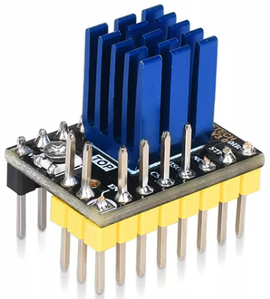
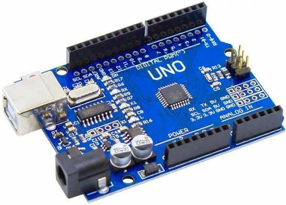

# examples-tmc2130

tmc2130-arduino-uno

## TMC2130

### Hardware Platform

- [TMC2130 BigTreeTech v3.0](https://github.com/bigtreetech/BIGTREETECH-TMC2130-V3.0) (step motor driver)
  - Universal high voltage driver for two-phase bipolar stepper motor
  - Standard SPI and STEP/DIR simplify communication
  - Highest Resolution 256 microsteps per full step
  - DcStep (load dependent speed control)
  - Full Protection & Diagnostics

### Software Platform

- SPI interface

## Arduino Uno

### Hardware Platform

- [Arduino Uno R3](https://docs.arduino.cc/hardware/uno-rev3) (microcontroller development board)
  - MCU ATmega328P (8-bit AVR RISC)
  - SRAM 2kB
  - FLASH 32kB
  - EEPROM 1kB
  - DI/O 14x
  - AI 6x
  - PWM 6x
  - TIM 3x
  - ADC 1x (6-channels, 10-bit)
  - UART, I2C, SPI
  - Power 7-12V DC
  - I/O 5V 20mA DC

### Software Platform

- IDE Arduino 1.8.18
- Language
  - C, C++
- Frameworks, External Libraries
  - [TMC2130Stepper](https://github.com/teemuatlut/TMC2130Stepper)
  - [arduino-timer](https://deepbluembedded.com/arduino-timer-library)

## Project

**used periphery**

- Arduino Uno
  - UART (debug menu, debug monitoring)
  - SPI  (connectrion with TMC2130)
  - TIM1 (debug monitoring, TMC2130.STEP pulse generator)

**setup**

- init. UART, SPI, TMC2130
- print UART menu

**loop** (main loop)

- TIMER1 tick (usec tick, 2 tasks)
- read UART menu commands

**TIMER1_DiagMon_Task** (TIMER1 task)

- print diagnostic info of TMC2130
- periodical mode (T=2sec)

**TIMER1_StepGen_Task** (TIMER1 task)

- pulse generator for TMC2130.STEP pin
- periodical mode (T=100usec)
